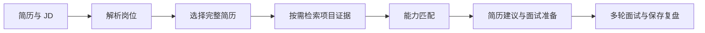

# AI 岗位匹配与面试准备助手

基于个人资料库的求职辅助应用：上传简历、输入岗位 JD，获取能力匹配、简历建议与面试准备内容，再进行多轮模拟面试并保存复盘。

采用 Python + Streamlit，结合 OpenAI 兼容接口、RAG、固定工作流和模型驱动工具调用。定位为可本地运行的个人学习与作品展示项目，尚未进行大规模用户效果验证。

## 功能

- **岗位分析**：普通模式直接分析简历与 JD；RAG 模式选择完整简历，并按需检索项目补充证据。
- **模拟面试**：独立练习或沿用当前／历史分析。题目来源为技术理论、简历项目、自选题库；支持 1–10 轮或持续练习直到主动停止，逐轮反馈并生成总结。
- **资料库**：分别保存完整简历与项目资料，支持 PDF、DOCX、TXT、Markdown。PDF 仅提取已有文字，不支持扫描件 OCR。
- **历史记录**：手动保存分析与复盘，按类型、时间筛选，通过标签页查看详情。
- **工程保障**：输出校验、工具白名单、超时重试、输入预算、检索降级、引用原文核对、脱敏调用指标。

## 工作原理



简历全文参与分析，项目资料以片段补充证据。项目资料入库经过规则清洗、结构切片和可选 AI 复核；查询经过向量召回、距离过滤与 AI 重排序，部分失败场景回退到规则结果。程序固定编排工作流，模型在工具白名单范围内决定是否检索和检索词，不执行任意代码。引用核对只验证原文存在，不保证模型推理正确。

## 运行前准备

1. **Python 3.11**：当前开发测试版本，建议使用独立虚拟环境。
2. **模型 API**：准备 OpenAI 兼容服务的 Base URL、API Key 和可调用模型名。可用已配置渠道的 OneAPI／OneAI，也可直接用兼容托管接口；不强制自行部署网关。
3. **网络和额度**：安装依赖、首次下载嵌入模型需要网络；大模型调用可能收费，需有效额度。
4. **测试资料**：自行准备简历与岗位 JD，仓库不提供作者真实资料或密钥。

RAG 默认嵌入模型是 `BAAI/bge-small-zh-v1.5`，在本机运行；首次建库／检索可能下载并加载模型。普通岗位分析适合先验证 API 配置。模型驱动检索使用工具调用，模型和服务应支持相应接口。

## Windows PowerShell 启动

GitHub 点击 **Code → Download ZIP** 解压，或通过 Git 克隆。在能看到 README.md、app 的项目根目录打开 PowerShell：

```powershell
py -3.11 -m venv .venv
.\.venv\Scripts\python.exe -m pip install --upgrade pip
.\.venv\Scripts\python.exe -m pip install -r requirements.txt
Copy-Item .env.example .env
```

复制配置仅在首次执行；已有 `.env` 时不要覆盖。若没有 `py`，确认 `python --version` 是 3.11 后用 `python -m venv .venv`。

编辑 `.env`，替换以下占位符：

```dotenv
LLM_BASE_URL=https://your-provider.example/v1
LLM_API_KEY=replace_with_your_api_key
LLM_MODEL=replace_with_your_model_name
LLM_TEMPERATURE=0.2
LLM_TIMEOUT_SECONDS=60
LLM_MAX_RETRIES=2
LLM_MAX_INPUT_CHARS=100000
```

Base URL 是模型 API 地址，不是控制台网页或 Streamlit 页面。按供应商说明填写，通常以 `/v1` 结尾，不重复追加 `/chat/completions`。占位域名不能实际调用。超时针对单次请求，含重试时总耗时可能更长；输入预算按字符计算，不是 token。

```powershell
.\.venv\Scripts\python.exe -m streamlit run app/main.py
```

打开终端给出的地址，通常为 `http://localhost:8501`。按 `Ctrl+C` 停止。项目关闭了文件监听，修改代码后需重新启动。

macOS／Linux 可用 `python3.11 -m venv .venv`，将后续解释器路径替换为 `.venv/bin/python`；这些平台尚未单独验证。

## 建议体验顺序

1. 普通岗位分析：上传或粘贴完整简历和 JD，查看结果标签页并按需保存。
2. 点击“去模拟面试”，确认设置后开始，提交真实回答并查看反馈。
3. 在资料库添加完整简历与项目报告，再体验 RAG；项目资料库可以为空。
4. 结束面试后保存复盘，在历史记录回看。

独立面试中，理论题必须有 JD，项目题必须有真实完整简历，自选题库必须上传题目。临时题库只保留在当前会话，尚未保存的页面状态不能当作持久记录。

## 数据与隐私

- 简历：`data/resumes/`；向量索引：`data/vector_store/`；历史：`data/history.sqlite3`。目录由程序创建。
- `.env` 和整个 `data/` 被 Git 忽略；`.env.example` 只有占位配置。
- **本地存储不等于完全离线**：分析、面试和 AI 入库复核会向配置的模型服务发送相关简历、JD、项目片段或回答。请确认有权使用资料，并了解服务商的数据政策。
- 历史仍可能包含敏感 JD、项目证据、回答与生成内容。分享日志、截图或导出文件前应检查。
- 当前没有账号隔离、访问认证或存储加密，适合个人本地使用。

## 代码结构和技术栈

```text
app/
  main.py       # Streamlit 入口
  config.py     # 环境配置
  llm/          # 模型调用、预算、指标
  services/     # 分析、面试、工作流
  rag/          # 清洗、切片、检索、简历库
  tools/        # 工具定义与受限执行
  storage/      # SQLite 历史与快照
  ui/           # 页面组件和样式
prompts/        # 任务提示词
tests/          # 自动化测试
docs/           # 报告和阶段文档
.streamlit/     # 主题与服务配置
```

使用 Streamlit、LangChain / langchain-openai、Chroma、Sentence Transformers、SQLite、PyMuPDF、python-docx 和 python-dotenv。项目接入外部大模型，没有训练自己的语言模型。

## 测试与边界

```powershell
.\.venv\Scripts\python.exe -m unittest discover -s tests -p "test_*.py" -v
```

测试覆盖面试状态、输入约束、历史快照、工具调用、检索和 UI 等，多数使用模型替身、合成输入和临时存储。通过测试不代表模型效果达到某个准确率。

目前仅有限个人资料验证，没有多用户评测、检索消融结论或生产并发验证。依赖未全部锁定，未完成独立干净环境安装验收。长面试发给模型的历史会限长，总结在较多轮数时抽样摘录，并非全量逐字审阅。

## 排查问题

- 401／403：检查密钥、模型权限与渠道，不要把 Key 贴到 Issue。
- 502／超时：检查模型网关、上游和网络；应用页面正常不代表模型接口正常。
- 首次 RAG 较慢：检查嵌入模型下载、网络和本机资源。
- PDF 没有文字：扫描件需要自行转为文本，当前未集成 OCR。
- 找不到模块：使用同一虚拟环境解释器安装和启动。
- 修改页面没生效：重启 Streamlit。

GitHub 托管代码，不会因为上传仓库就自动运行应用；GitHub Pages 不能直接执行这个 Streamlit 服务。

## 文档

- [项目报告](docs/project_report.md)
- [新手学习指南](docs/project_learning_guide.md)
- [工程质量与边界](docs/stage_10_engineering.md)
- [首次上传 GitHub 教程](docs/github_upload_guide.md)

阶段文档保留演进记录，当前使用方式以本 README 和实际代码为准。项目使用 AI 辅助开发，展示时应如实说明个人的需求、设计、验证与学习过程。
