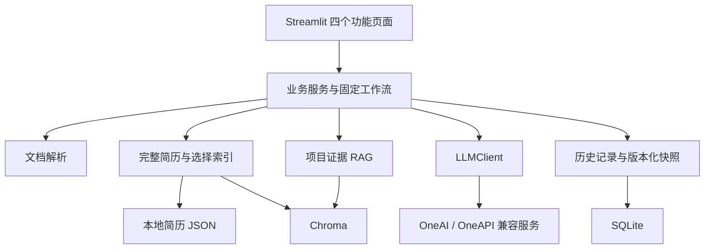
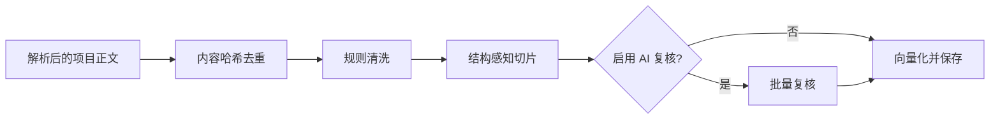
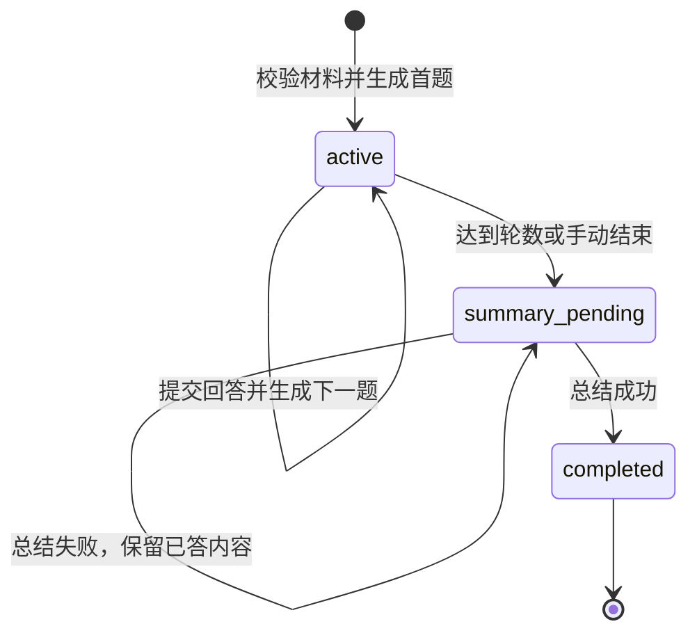

# 基于个人资料库的 AI 岗位匹配与面试准备助手

## 项目设计与实现报告

文档版本：1.0  
编写日期：2026 年 9 月 9 日  
项目类型：个人 AI 应用开发项目  
当前定位：面向本地使用、具备完整业务闭环的求职准备应用  
实现范围：阶段一至阶段九，以及阶段十的基础工程改进

> 本报告依据当前代码、阶段文档及最近一次测试结果编写。项目使用现有大模型接口，不涉及模型预训练或微调。当前真实材料主要为一份个人简历，尚未开展多用户测试和端到端效果对照实验。文中的设计目标、实现结果和待验证效果分别陈述，不以自动化测试数量代替模型质量指标。

## 摘要

求职准备通常需要反复整理简历、理解岗位要求、查找项目细节并练习回答。通用聊天工具虽然能够提供建议，但用户需要重复输入材料，分析依据不易回溯，岗位分析与面试练习之间也缺少稳定的衔接。

本项目围绕上述问题，构建了一个基于个人资料库的 AI 岗位匹配与面试准备助手。系统采用 Python 与 Streamlit 实现交互界面，通过 LangChain 的 ChatOpenAI 封装调用 OneAI／OneAPI 等 OpenAI 兼容接口；使用 Chroma 管理向量索引和项目证据，使用 SQLite 保存分析与面试历史。系统支持 PDF、DOCX、TXT 和 Markdown 解析、多份完整简历管理、岗位分析、项目证据检索、模拟面试及历史复盘。

在 AI 处理链路上，系统采用固定工作流组织任务，仅在是否检索及检索 query 生成等有限环节引入模型决策。项目资料依次经过规则清洗、结构感知切片、可选 AI 批量复核、向量检索、规则过滤与 AI 重排序。匹配结论可附带原文引用，由程序核查引用是否实际出现在输入中。面试模块提供题源约束、反馈校验、总结失败重试与上下文预算控制。

最近一次完整自动化测试共执行 149 项，全部通过，用时约 23.5 秒。该结果支持关键程序行为和回归稳定性的判断，不构成对检索准确率、评分一致性或求职效果的验证。项目已形成可演示的本地应用闭环，后续重点是完善可复现交付，并在数据条件允许后开展效果评测。

关键词：大模型应用；RAG；受控工具调用；岗位匹配；模拟面试；证据核查；Streamlit

## 1. 项目背景与目标

### 1.1 业务背景

求职材料分散在简历、项目报告、实现说明和面试题库中。简历适合概括经历，往往无法容纳完整的技术细节；岗位 JD 则会因职位和招聘方而发生变化。用户需要从不同材料中找到与目标岗位相关的内容，并将其转化为简历表达和面试回答。

直接依赖一次性模型问答存在几个实际问题：材料需要重复提交；模型可能把建议中的能力误写成用户已经具备的能力；长项目资料容易引入噪音；多轮练习的反馈缺少结构化保存；失败时难以判断问题出在输入、检索还是模型调用。

因此，本项目的重点是将模型调用组织成一个有输入管理、流程约束、结果查看和历史保存能力的软件系统。

### 1.2 项目目标

1. 建立可重复使用的个人资料管理入口，减少反复整理材料的操作。
2. 根据岗位 JD 生成匹配点、材料缺口、简历建议与面试准备方向。
3. 从项目材料中检索补充证据，使分析能够利用简历之外的细节。
4. 将岗位分析与多轮模拟面试衔接，形成准备、练习、反馈和复盘闭环。
5. 通过输入校验、工具约束、失败恢复和自动化测试提高程序可靠性。
6. 保留可供面试讲解的工程决策与验证依据。

### 1.3 定位与非目标

当前版本面向个人本地使用。它辅助用户准备求职材料，不替招聘方作录用决策，也不保证建议能够提高录用概率。

系统没有实现生产级多租户、用户鉴权、并发任务队列或云端部署验证；没有训练自己的语言模型；没有构建自由调用任意工具的自主 Agent；没有以增加多 Agent 数量作为复杂度目标。

## 2. 需求分析

### 2.1 核心用户流程

用户首先上传或粘贴简历与岗位 JD，选择普通分析或 RAG 模式，查看岗位要求和匹配结论。分析完成后，用户可以保存结果，也可以进入模拟面试并明确点击开始。练习结束后保存复盘，在历史记录中查看原始回答与反馈。

独立模拟面试不要求先执行岗位分析。用户可以直接选择岗位技术理论、简历项目经历、自选题库中的一种或多种来源，并提供对应材料。

### 2.2 功能需求

- 文档输入：解析常见文本型文件；解析失败时显示错误并允许恢复输入。
- 简历管理：保存多份全文简历，按岗位自动选择或手动指定，支持预览和删除。
- 项目资料管理：清洗、切片、审核、入库、查看片段和重复资料提示。
- 岗位分析：提取岗位要求，形成匹配点、缺口、简历建议与面试问题。
- 模拟面试：提供 1–10 轮或手动结束的循环练习，保留每轮问题、题源、原始回答及反馈。
- 历史记录：主动保存、按类型和时间筛选、查看详情、删除及复用历史分析。
- 证据展示：区分模型结论与原文引用，对引用执行字面存在性核查。

### 2.3 约束与质量要求

项目经历题必须取得真实完整简历；理论题必须取得 JD；题库题必须取得有效题库。输入资料不足时拒绝启动相应面试，而不是让模型补全用户经历。

页面切换应保留当前会话输入和面试进度。长期保留的结果由用户主动保存；不能把页面会话状态当作持久化存储。

模型调用必须有有限超时与重试策略。日志不应记录完整 Prompt、回答或密钥。测试应覆盖异常路径，而不只检查正常输出。

## 3. 技术选型与总体架构

### 3.1 技术选型

**Python 与 Streamlit。** Python 承载文档处理、模型调用及数据处理逻辑；Streamlit 提供表单、文件上传、标签页和会话状态，适合快速构建可交互的个人应用。其脚本重运行机制要求显式管理组件状态，同时也限制了当前版本向复杂多用户服务扩展的方式。

**LangChain ChatOpenAI 与 OpenAI 兼容接口。** 项目使用现有封装调用聊天模型和绑定工具 Schema，模型由 OneAI／OneAPI 等服务提供。使用该封装并不等于采用了复杂的 LangChain Agent；主要流程由项目代码显式编排。

**Chroma 与 Sentence Transformers。** Chroma 保存向量与片段元数据，默认 embedding 模型为 `BAAI/bge-small-zh-v1.5`。简历选择索引与项目资料集合分开管理。模型下载与首次初始化会带来额外开销，不能将其等同于普通页面渲染成本。

**SQLite。** 分析和面试结果属于有类型、有时间、有详情的结构化记录，采用独立 SQLite 数据库保存，避免与向量库混用。

**PyMuPDF 与 python-docx。** 分别处理 PDF 和 Word 文本提取。TXT、Markdown 通过编码解码后进入统一文本处理流程。

### 3.2 分层架构



界面层负责收集输入和展示状态，业务层组织分析与面试步骤，工具层定义可调用能力，数据层管理简历、项目材料和历史快照，模型层统一外部调用。各层不是独立部署的微服务，而是同一应用中的模块分工。

### 3.3 主要目录

```text
app/
  main.py                 页面入口与导航
  config.py               模型配置读取
  llm/                    统一模型调用与指标记录
  services/               岗位分析、面试、规划、复核与重排序
  tools/                  工具 Schema、执行结果与调用记录
  rag/                    简历存储、清洗、切片和向量检索
  storage/                历史数据库与结果快照
  ui/                     页面组件、结果展示与会话输入管理
prompts/                  按任务分开的 Prompt 模板
tests/                    单元与交互回归测试
docs/                     阶段说明、路线与项目报告
data/                     本地运行数据，不作为公开演示材料
```

## 4. 资料管理与 RAG 设计

### 4.1 文档解析

PDF 使用文本提取方式读取，并添加页码文本标记；DOCX 提取段落和表格内容；TXT 与 Markdown 尝试 UTF-8 等编码，统一清理行尾与空白。解析结果包含文件名、类型和正文。

当前没有 OCR。扫描 PDF 或不可提取文字的文件可能无法解析；复杂多栏 PDF、复杂 Word 排版的阅读顺序也未保证完整还原。因此，“支持 PDF”指具备文本提取能力，不代表能够理解任意版式或图像文档。

### 4.2 为什么分开保存简历和项目材料

简历是候选人整体经历的概括，不能仅依靠少量向量召回片段代表其全部能力。因此，系统通过索引帮助选择简历，但最终将选中简历的全文用于核心分析。

项目报告用于补充细节，通常较长，适合按岗位检索相关片段。这样既保留候选人总体信息，又能按需引入项目证据。全文输入仍受模型调用长度预算限制，过长时会提示用户减少材料。

### 4.3 项目资料入库流程



规则清洗用于处理重复页眉页脚、格式噪音及明确非正文内容；切片优先参考章节、段落和项目单元，而不是无条件按固定窗口截断。默认切片目标长度为 700 字符。接口保留的 `overlap` 参数仅用于兼容旧调用，当前实现不再使用固定滑窗重叠。

启用 AI 复核时，规则保留的片段按默认每批 5 个处理。审核失败遵循保守保留策略，避免仅因一次模型错误丢失资料。每个入库片段记录来源文件、章节、片段编号、内容类型和清洗状态等元数据。

清洗与复核的目的是减少噪音进入后续分析，不代表已经通过实验测得召回质量提升。

### 4.4 检索与证据选择

RAG 模式首先取得有效简历，随后由模型在受限范围内决定是否补充检索，并生成 query。向量库返回候选片段，再经过内容与距离过滤。AI 重排序从候选中选择适合当前岗位的项目证据；重排序失败时使用规则选择结果。

当前主要默认值包括：候选上限 10、最终片段上限 5、最大距离 0.8、规则距离断层阈值 0.25。这些参数是实现基线，尚未经跨数据集校准；向量距离不是匹配概率，更不是招聘通过概率。

没有有效结果时，系统明确告知未采用项目库证据，并继续基于其他输入进行分析。需要区分“检索无结果的降级”和“外部服务异常”：并非所有错误都可以自动恢复，部分工具失败仍会中止当前分析并显示错误。

### 4.5 资料库切换性能改进

早期页面统计数量时也可能触发 embedding 初始化；折叠片段区虽然未展开，Streamlit 仍执行其中的读取逻辑。这使资料库切换看起来像页面阻塞。

改进后，统计和读取已有资料使用不加载 embedding 的读取路径，并与需要模型的写入／检索句柄分开。片段正文在用户打开浏览入口后才读取。该改动通过行为测试验证；尚未提供真实机器上的切换延迟前后对比数据。

## 5. 岗位分析与受控工具调用

### 5.1 固定工作流

岗位分析按以下顺序执行：JD 解析 → 可选简历选择与项目检索 → 能力匹配 → 简历建议 → 面试准备。

JD 解析输出职责、必备技能、加分项、关键词与面试关注点；匹配服务输出已体现的能力和材料缺口；建议服务区分“当前可以修改的表达”与“完成补充项目后才能增加的表达”。最后生成针对性问题与短期准备建议。

采用固定流程是因为步骤及输入依赖较明确。显式编排便于排查错误、控制调用次数和测试每个环节。它属于带模型决策环节的工作流，不应描述成完全自主的多智能体系统。

### 5.2 工具调用边界

关键能力封装为带 Schema 的工具。模型驱动规划目前主要用于项目检索，而非任意调用系统能力。程序只接受一次指定检索工具调用，并检查工具名称及 query 类型。

当规划使用 JSON 回答时，`use_search` 必须为真正的布尔值。字符串 `"false"` 不会再因 Python 的真值转换而被当成需要检索。无效文本规划保守跳过；违规工具调用会报错，不执行其请求。

### 5.3 原文引用核查

匹配结果增加可选 `citations` 字段，每条引用关联一个匹配点，包含来源类别与逐字原文。程序检查匹配点下标、来源、引用长度，并在对应输入中查找原文位置。

页面区分“原文已核对”和“未通过核对”，并允许展开查看引用。引用缺失时也会说明当前没有可逐字核对的证据。

这一机制检查的是字符串存在性，不验证论证是否充分、岗位要求是否理解正确，或用户经历是否真实。它没有实现页码级定位、稳定的跨版本证据 ID 或所有结论强制引用；项目引用的核对范围是本次项目检索上下文。

## 6. 多轮模拟面试

### 6.1 两种启动方式

独立面试由用户直接选择题源和资料；基于岗位分析的面试可以沿用当前分析或选择历史分析。岗位分析页的“去模拟面试”负责跳转，实际开始仍由用户确认。

理论题使用岗位 JD；项目题使用真实完整简历；自选题库从临时上传文件提取题目。可组合题源，程序校验模型返回的来源标签是否属于用户选择范围。来源标签合法不等于题目语义一定符合来源，因此仍保留人工判断的必要性。

### 6.2 状态与反馈



每轮记录包括题目、题源、用户原始回答、分数、优点、改进项、建议回答结构和整体反馈。非空回答允许提交，包括“没有相关经历”；不要求用户编造经历。评分与反馈的内容质量仍由模型和人工核查共同决定。

分数必须为 0–100 的整数，关键反馈字段必须存在；格式错误不会再自动转为零分或缺省评价。总结失败时会进入独立的待总结状态，用户重试总结不需要重新提交原始回答。

### 6.3 长对话预算

固定轮数支持 1–10，循环模式由用户主动结束。为控制单次请求长度，后续出题使用最近 8 轮历史，问题、回答和反馈分别最多截取 1000、3000、1000 字符。界面保存的原始记录不受此截断影响。

最终复盘使用覆盖全程的摘录；每轮问题、回答和反馈分别限长 120、250、180 字符，超过 50 轮时均匀抽样。Prompt 与页面明确说明这一限制。它是确定性的文本预算方案，不是经过评测的长期记忆系统，可能遗漏中间细节。

## 7. 历史数据与隐私边界

### 7.1 存储分工

完整简历正文保存于本地简历库，向量索引用于选择；项目正文片段与元数据保存于 Chroma；分析和复盘保存于独立的 `data/history.sqlite3`。

历史记录包含 ID、类型、标题、创建和更新时间、关联分析 ID 及 JSON 快照。数据库为时间和关联字段建立索引，通过版本信息识别兼容范围。连接按操作短时使用，避免长期持有数据库锁。

### 7.2 快照与复用

历史保存采用显式字段选择，而不是序列化运行对象、模型客户端或完整会话。快照包含结构化结果和必要引用，简历通过 ID 与指纹关联。历史面试复用时，重新核对简历上下文，防止以空文本或错误版本启动项目面试。

完整简历不作为专门的正文副本保存到历史；新增简历原文引用仅在当前分析展示。项目引用可保存，并在恢复历史时重新核对。历史仍可能含有 JD、项目片段、用户回答和模型建议中的个人信息，因此不能称为匿名数据。

### 7.3 删除与本地使用边界

简历删除和清空经过确认；历史删除不会清空简历或项目库。删除关联分析后，已有面试复盘可以作为独立记录保留。题库只保存在当前会话中，不建立持久化题库。

“本地保存”不等于“资料不离开电脑”。执行分析、AI 复核或面试时，相应文本会发送给配置的模型服务。当前没有生产级加密、用户隔离或完整 Prompt 注入防护。分享项目时应使用脱敏资料，检查聊天记录、输出文件及示例材料，而不仅检查 `.env`。

## 8. 工程质量与交互设计

### 8.1 统一调用控制

模型层支持配置：单次请求超时默认 60 秒、SDK 最大重试默认 2 次、输入字符预算默认 100000。包含重试时，总等待时间可能超过 60 秒。字符预算不能精确代表 token，不同模型的上下文限制仍需单独考虑。

本地 OneAPI 地址采用直接连接方式，避免继承代理变量后错误地把回环地址请求转发出去。异常继续向上层传播，由相应页面显示操作结果；并非所有错误提示都已统一成同一种用户语言。

### 8.2 运行指标

调用层在终端输出结构化 `llm_call` 记录，包括调用 ID、模型、系统 Prompt 指纹、输入字符数、耗时、成功状态、异常类型和输入／输出 token。进程内保留最近 200 条指标。

指标不包含 Prompt 正文、答案、API Key、URL 或异常详情。供应商未报告 token 时记为未知，而非零。当前记录不是完整工作流追踪：未记录实际 SDK 重试次数、所有失败请求消耗或价格，也没有建立指标数据库与看板。

### 8.3 输入与输出校验

JSON 解析要求顶层对象；字符串列表不再接受任意对象隐式转换；检索参数、面试评分和引用字段有专门校验。当前尚未对所有服务应用统一严格 JSON Schema，部分字段仍有兼容性默认值。

### 8.4 页面设计

应用使用顶部导航划分岗位分析、模拟面试、资料库和历史记录。主体居中留白，采用浅色底和主卡片区分页面层次；减少内层套框，通过标题和分隔线组织内容。

分析结果与面试复盘使用标签页，选择控件分开显示字段名和选中值，标注单选／多选，未选时提示点击。简历全文使用可关闭弹窗预览。大文本框固定尺寸，内部滚动阅读，避免拖动后破坏布局。

Streamlit 的文件监听已关闭，代码与主题更新后通常需要手动重启。UI 使用了针对 Streamlit DOM 的 CSS 选择器，后续升级依赖时仍需进行视觉回归检查。

## 9. 测试与验证

### 9.1 最近一次测试结果

截至本报告编写时，最近一次完整测试执行 149 项，全部通过，用时约 23.5 秒。执行命令如下：

```powershell
.\.venv\Scripts\python.exe -m unittest discover -s tests -p "test_*.py" -v
```

该耗时是现有开发环境中测试套件的运行时间，不是模型分析耗时、页面响应时间或性能压测结果。

### 9.2 验证内容

- 文档解析、输入失败恢复与资料去重。
- 简历选择、过滤与重排序回退行为。
- 工作流输出和受限模型工具决策。
- 题源约束、轮次控制、评分校验及总结重试。
- 历史保存恢复、引用省略规则和删除隔离。
- 页面导航、会话状态保留、上传失败处理和确认弹窗。
- 读取资料库时不初始化 embedding、未请求浏览时不提前读片段。
- 超长输入在模型调用前拒绝、运行日志不包含正文或密钥。
- 引用真假核对、历史引用重新核对及失败引用警告展示。

测试主要使用合成文本、模型替身、临时存储和 Streamlit AppTest。它们验证预定行为与异常边界，不能模拟所有真实模型输出。

### 9.3 尚未验证的内容

没有多简历、多岗位标注评测集；没有 RAG 与无 RAG 的效果对照；没有检索 Recall、引用正确率、评分一致性等真实数据指标；没有多用户研究、负载测试或新机器安装成功率数据。当前也未建立完整覆盖率报告。

因此，报告仅将“功能实现”“回归测试通过”作为已有成果，不报告幻觉下降比例、准确率提升或求职成功率变化。

## 10. 关键难点与设计取舍

### 10.1 事实完整性与输入长度

将全文简历与项目 RAG 分开，解决了简历被局部召回代替的问题；代价是多轮服务可能重复输入简历，并受长度预算限制。后续可以研究结构化经历索引，但不能以压缩为由丢掉事实边界。

### 10.2 清洗强度与证据保留

规则和 AI 复核可以剔除明显无用材料，但过度清洗可能损失证据。因此对 AI 审核失败采用保守策略，并展示清洗统计。没有标注数据时，不把“删除更多片段”当成质量提升。

### 10.3 模型灵活性与程序约束

模型负责检索判断和问题生成等适合语义处理的部分；程序负责工具白名单、来源范围、状态转移及字段合法性。约束可以减少无效动作，却无法替代对语义正确性的评测。

### 10.4 可回看与上下文成本

完整面试记录用于用户回看，预算化摘录用于模型推理。两者分开避免了直接删掉历史记录，但也意味着模型不能看到全部细节，界面必须说明这一点。

### 10.5 引用可追溯与能力判断

原文存在性核查提供了比纯文字解释更明确的检查入口，但原文出现某个技术名称，不代表用户掌握该技术。引用核查应当辅助审核，而不是成为“正确性认证”。

## 11. 项目成果与当前局限

项目已经形成从资料准备到分析、练习及复盘的功能闭环，并体现了模块分层、受控工具调用、异常恢复、数据持久化和自动化回归等工程实践。其价值在于把多个 AI 能力组织成可使用、可检查的应用，而非提出新的模型算法。

目前最适合作为 AI 应用开发实习或初级岗位的个人作品展示。项目不能单独证明生产环境运维、高并发架构或模型研究能力，也不能替代个人对实现原理的掌握。

当前阶段十属于基础工程改进，不代表生产化完成。依赖尚未完全锁定，未完成干净环境安装验证，当前项目目录没有 Git 仓库与 CI 流程；没有用户鉴权与数据隔离。模型输出校验与错误分类仍可继续收敛。

## 12. 后续规划

### 12.1 不依赖额外数据的工作

1. 整理公开代码与脱敏演示材料，建立版本管理与自动化检查。
2. 锁定依赖并在干净环境验证安装、启动和测试。
3. 扩展严格输出结构校验，统一常见失败提示。
4. 增加任务级 trace 与可恢复中间结果，将调用指标关联到工作流阶段。
5. 为证据建立更细的来源位置与版本标识，检查未引用结论的展示方式。

### 12.2 有数据条件后再推进的工作

建立覆盖正常匹配、无相关经历、资料冲突和检索无结果的标注案例，对比无检索、基础检索和重排序方案。结合人工检查，记录效果、耗时及成本，再决定是否增加混合检索、query 改写或有限二次检索。

面试模块可以进一步验证评分一致性与反馈可执行性；真实用户试用应基于明确授权，避免为了扩充样本收集不必要的个人材料。当前这些工作延期，不以合成测试替代真实结论。

### 12.3 按岗位选择深入方向

AI 应用方向优先完善证据与评估；后端方向可探索 API 服务、后台任务与数据隔离；产品方向可在具备用户条件后验证流程完成情况与建议采纳情况。进阶方向应由实际问题驱动，不为了技术名称增加多 Agent 或模型微调。

## 13. 部署与演示说明

### 13.1 运行配置

项目通过 `.env` 读取 `LLM_BASE_URL`、`LLM_API_KEY`、`LLM_MODEL` 与可选温度、超时、重试和字符预算配置。密钥不可填写进示例报告或提交到公开仓库。Base URL 应指向模型 API 服务，而非 Streamlit 页面。

现有虚拟环境中可执行：

```powershell
.\.venv\Scripts\python.exe -m streamlit run app/main.py
```

新环境需创建虚拟环境并安装 `requirements.txt`。由于部分依赖未锁定且 embedding 模型可能需要首次下载，新环境可复现性仍待专项验证。

### 13.2 推荐演示流程

1. 使用脱敏简历与示例 JD 进行普通分析，展示结果标签和原文核查。
2. 展示简历库与项目库的分工，说明 RAG 检索结果及无结果处理。
3. 从分析结果进入面试，明确确认题源与轮数后开始。
4. 完成回答并查看逐轮反馈，说明原始回答与模型评价分别保留。
5. 保存分析或复盘，在历史记录中查看；说明未保存会话的生命周期。
6. 使用预先准备的合成失败案例说明字段校验和总结恢复，不依赖现场故意制造网络错误。

演示前应确认模型服务可用，并准备脱敏的已保存结果作为网络不稳定时的展示材料。录制演示前检查页面、终端及历史数据，避免泄露密钥或真实个人信息。

## 14. 面试讲解与简历表达

### 14.1 三分钟讲解提纲

第一部分说明问题：求职材料分散，通用模型问答难以持续复用资料并保留依据。

第二部分说明方案：全文简历选择与项目 RAG 分工，固定工作流组织 JD、匹配和建议，再通过多轮面试与历史保存形成闭环。

第三部分讲一个真实工程难点，例如资料库统计触发模型初始化、面试总结失败恢复或无效工具输出。按照“现象—定位—修改—验证”说明，不只罗列技术栈。

最后说明证据与边界：149 项回归测试通过，但没有真实效果对照；下一步重点是评估和可复现交付。开发中使用 AI 辅助的部分应如实说明，个人应能解释关键逻辑并独立调试。

### 14.2 简历项目描述示例

> 开发基于个人资料库的 AI 岗位匹配与面试准备助手，使用 Python、Streamlit、Chroma、SQLite 和 OpenAI 兼容接口实现资料管理、岗位分析、多轮模拟面试与历史复盘闭环。构建项目证据清洗、检索过滤与重排序流程，引入受控模型检索决策、原文引用核查、调用预算和失败恢复机制，建立 149 项自动化回归测试。

上述描述适用于当前实现。后续测试数和功能发生变化时需同步更新，不添加未经测量的效果或性能数字。

## 15. 结论

本项目已完成一个本地 AI 应用的主要功能闭环，并在事实输入、流程约束、结果保存和失败处理方面形成了明确设计。当前实现可以作为个人项目进行演示和求职讲解。

项目的下一步价值不在于继续扩大功能数量，而在于提高可复现性、补齐模型输出与任务观测边界，并在数据充足时验证检索与反馈是否确实有用。当前应将其定位为具备基础工程质量的个人应用成果，保留对模型效果和生产化能力的准确边界。

## 附录：实现依据

本文依据项目内部实现编写。主要对应文件如下，路径均相对项目根目录：

- 入口与状态：`app/main.py`、`app/ui/session_widgets.py`。
- 模型调用：`app/config.py`、`app/llm/client.py`。
- 岗位工作流：`app/services/job_prep_workflow.py`、`app/services/tool_planner.py`。
- 文档与 RAG：`app/services/document_parser.py`、`app/rag/resume_store.py`、`app/rag/document_cleaner.py`、`app/rag/chunking.py`、`app/rag/vector_store.py`。
- AI 审核与重排序：`app/services/chunk_reviewer.py`、`app/services/retrieval_reranker.py`。
- 匹配与引用：`app/services/match_analyzer.py`、`app/ui/analysis_result.py`。
- 面试：`app/services/interview_session.py`、`app/services/history_interview.py`、`app/ui/interview_history.py`。
- 历史：`app/storage/history_repository.py`、`app/storage/history_snapshots.py`。
- 测试依据：`tests/`，特别是 `tests/test_engineering_quality.py` 与相关交互、存储及检索回归测试。
- 阶段边界：`docs/project_roadmap.md`、`docs/stage_10_engineering.md`。

本报告未引用真实个人简历正文、API 配置值或用户面试原始回答。
