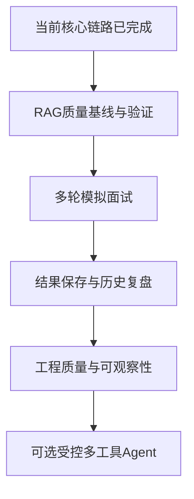

# 整体项目后续开发路线图

> 最后更新：2026-09-08  
> 使用方式：每完成一个阶段，将对应状态改为“已完成”，并同步更新 README 与阶段说明文档。

## 当前状态

项目已经完成可演示的核心 AI 应用链路：

- [x] 文档解析与个人资料库构建；
- [x] RAG 检索、内容去重、片段查看；
- [x] JD 解析、能力匹配、简历建议、面试题生成；
- [x] 固定流程 Agent 工作流；
- [x] 基础 Tool Calling 与执行日志；
- [x] 模型驱动的“是否检索资料库、如何生成 query”决策（第六阶段）。

当前版本可作为 AI 应用开发实习的项目作品进行演示。后续工作重点是补齐“求职准备助手”的交互闭环，并提高检索质量、稳定性与可维护性；不以实现全自主 Agent 为目标。

## 总体路线

## 阶段七：RAG 质量基线与验证

状态：已完成

### 阶段七目标

减少无关资料片段进入 Prompt 的概率，让检索结果的好坏可观察、可验证。

### 阶段七工作项

- 展示检索距离、有效片段数量和“未命中足够相关资料”的提示；
- 设计相关性过滤规则，过滤明显无关的召回结果；
- 准备少量固定测试样例：岗位 JD 与预期召回的个人资料；
- 为资料去重、检索排序、空结果和过滤规则补自动化测试；
- 明确检索为空或结果质量不足时，后续分析的降级行为。

### 阶段七完成标准

- 资料库含有明显无关内容时，不会将其直接用于后续分析；
- 页面可解释本次实际采用了多少有效片段；
- 典型岗位 JD 的检索结果可由测试验证。

### 阶段七涉及区域

- `app/rag/vector_store.py`
- `app/services/job_prep_workflow.py`
- `app/main.py`
- `tests/`

## 阶段八：多轮模拟面试

状态：已完成

### 阶段八目标

补齐用户使用闭环，使项目从一次性岗位分析工具升级为可练习的面试准备助手。

### 阶段八工作项

- 新增面试服务与 Prompt：生成首个问题、评价回答、生成追问与总结报告；
- 在 Streamlit 增加“开始面试、提交回答、查看反馈、继续追问、结束面试”的交互界面；
- 使用 `st.session_state` 保存当前会话的问题、回答、反馈、轮次和状态；
- 支持 1–10 轮或手动结束；通过上下文预算限制单次请求长度；
- 结束时生成强项、薄弱点、推荐回答结构和练习建议。

### 阶段八完成标准

- 用户可围绕一个岗位完成至少三轮问答；
- 每轮均能看到针对性反馈；
- 结束后可得到完整的面试复盘报告。

### 阶段八涉及区域

- 新增 `app/services/interview_session.py`
- 新增 `prompts/interview_*.txt`
- `app/main.py`

## 阶段九：结果保存与历史复盘

状态：已完成

已实现主动保存、类型/时间筛选、完整复盘详情、关联删除隔离与历史面试的真实简历校验。使用与边界见 `stage_9_history.md`，原计划见 `stage_9_history_plan.md`。

### 阶段九目标

支持保留和比较多次岗位分析、面试练习的关键结论。

### 阶段九工作项

- 使用 SQLite 保存分析任务摘要、岗位 JD 摘要、关键结论、面试记录和创建时间；
- 在页面提供历史列表、详情查看与删除功能；
- 支持根据历史分析结果重新开始模拟面试，减少重复模型调用；
- 不保存 API Key；原始个人文档继续由本地资料库管理，避免不必要的敏感信息复制。

### 阶段九完成标准

- 应用重启后，已保存的分析摘要和面试报告仍可查看；
- 用户可以删除不再需要的历史记录；
- 历史功能不影响已有的普通分析和 RAG 分析流程。

### 阶段九涉及区域

- 新增 `app/storage/`
- `app/main.py`
- 新增数据库初始化与数据访问测试

## 阶段十：工程质量与可观察性

状态：基础改进已实现，真实效果评测与交付工程待完成。见 stage_10_engineering.md。

### 阶段十目标

提高系统稳定性、可维护性和项目演示时的可信度。

### 阶段十工作项

- 为 `app/services/`、`app/tools/`、`app/rag/` 补单元测试和工作流回归测试；
- 统一模型连接、文档解析、资料库、工具调用和模型非 JSON 输出的错误提示；
- 将工具调用信息区分为“用户可读执行摘要”和“开发调试详情”；
- 补充依赖安装、启动、测试、数据清理和隐私边界说明；
- 检查 README 中已完成与未完成功能的表述，避免文档超前于实际代码。

### 阶段十完成标准

- 关键流程具备自动化回归测试；
- 常见失败能提供可行动的排查提示；
- 新环境可按文档完成安装、启动与测试。

### 阶段十涉及区域

- `tests/`
- `app/llm/`
- `app/services/`
- `app/tools/`
- `README.md`
- `docs/`

## 可选进阶：受控多工具 Agent

状态：暂不安排

仅在前述阶段稳定后考虑，不是项目必须功能。

### 可探索内容

- 将能力匹配封装为独立工具；
- 让模型输出有限工具计划，但由代码校验工具白名单、参数和最大调用次数；
- 当首次检索质量不足时，允许最多一次二次检索；
- 评估更复杂的模型驱动决策是否实际提升分析质量。

### 明确不做

- 无限循环的 ReAct；
- 无约束的工具调用；
- 多 Agent 协作；
- MCP 或外部远程工具接入。

## 推荐开发顺序

1. 已完成阶段七的基础过滤、展示和测试；
2. 已完成阶段八的多轮模拟面试；
3. 已完成阶段九的本地历史保存；
4. 再集中完成阶段十的测试、异常处理和文档同步；
5. 只有在项目仍有展示或学习需求时，再研究受控多工具 Agent。

## 进度记录

- 阶段一：最小可用版本，已完成；LLM 岗位分析基础链路。
- 阶段二：文档解析，已完成；支持 PDF、docx、txt、md。
- 阶段三：RAG，已完成；资料库、去重与片段查看。
- 阶段四：固定 Agent 工作流，已完成；五步岗位分析。
- 阶段五：基础 Tool Calling，已完成；工具封装与调用日志。
- 阶段六：模型驱动 Tool Calling，已完成；模型决定是否检索及生成 query。
- 阶段七：RAG 质量基线与验证，已完成；已分离多简历全文库与项目资料库，并加入规则清洗、AI 批量片段复核、结构感知切片、AI 重排序自动选片和回归测试。
- 阶段八：多轮模拟面试，已完成；支持独立或分析后串联启动，可混合岗位理论、项目经历和临时题库，提供 1–10 轮或手动结束的循环问答、逐轮反馈、追问和复盘。
- 阶段九：结果保存与历史复盘，已完成；独立 SQLite 持久化、历史查看、删除隔离、校验简历后重新面试。
- 页面整理（2026-09-09）：采用顶部导航四分区，输入设置、分析结论、面试练习、资料管理与历史复盘按任务呈现；切页保留会话内容。见 `docs/page_layout.md`。
- 阶段十：工程质量与可观察性，基础改进已实现；真实效果评测延期，交付工程仍待完成。

- 交互升级（2026-09-09）：固定分析输入容器、结果/复盘标签页、按题源展开的勾选资料选择、简历弹窗预览与二次删除确认、历史摘要列表；轮数支持 1–10 或循环到用户停止。
